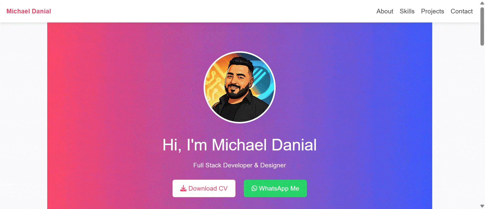
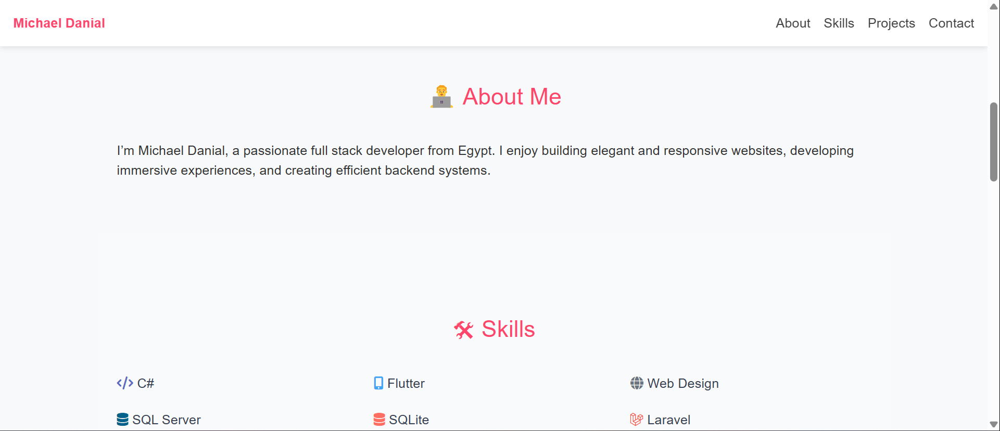
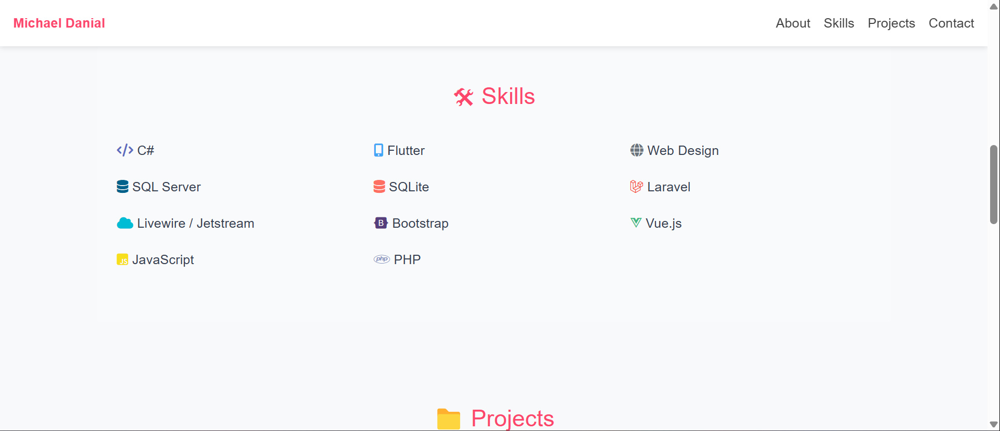
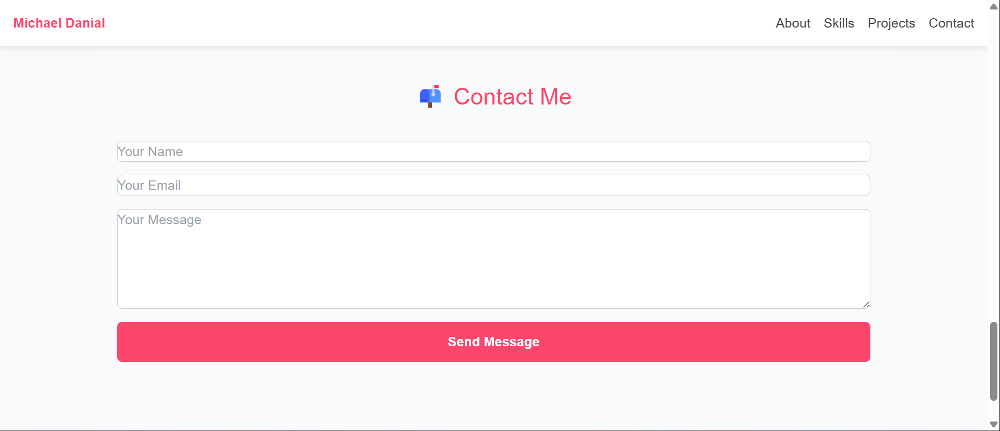

<<<<<<< HEAD
# 🎨 Creative Card-Based Layout

Welcome to my personal portfolio website!  
This project is built to showcase my skills, projects, and contact information as a Full Stack Developer & Designer.

---

## 👨‍💻 About Me

I'm **Michael Danial**, a passionate developer from Egypt.  
I create modern, responsive web experiences and design interfaces inspired by my love for technology and creativity.

---

## 🚀 Features

- Responsive and clean UI design
- Smooth animations using AOS
- Skill icons powered by Font Awesome
- Projects showcase section
- Fully working contact form
- WhatsApp and social links
- Downloadable CV

---

## 📸 Preview





---

## 🛠️ Built With

| Category     | Technologies                              |
|--------------|--------------------------------------------|
| Frontend     | HTML5, CSS3, JavaScript                    |
| Styling      | Tailwind CSS                               |
| Animations   | AOS (Animate on Scroll)                    |
| Icons        | Font Awesome                               |
| Fonts        | Google Fonts (Raleway)                     |
| Deployment   | GitHub Pages or Netlify                    |

---

## 🎨 Colors & Style

- **Primary Color**: `#fc466b` (Red)
- **Accent Hover**: `#2980b9`
- **Background**: White (`#f8f9fa`)
- **Text Color**: Gray (`#333`, `#666`)

Font used: `Poppins`, clean and modern.

---

## 📦 Getting Started

1. Clone the repo:
   ```bash
   git clone https://github.com/MichaelDanial95/Portfolio-Creative Card-Based Layout.git
   ```

2. Navigate to the folder:
   ```bash
   cd Portfolio-Creative Card-Based Layout
   ```

3. Open `index.html` in your browser.

---

## 📫 Contact Me

- 💌 Email: [michael1101995@gmail.com](mailto:michael1101995@gmail.com)
- 💼 LinkedIn: [linkedin.com/in/michaeldanial95](https://linkedin.com/in/michaeldanial95)
- 🧑‍💻 GitHub: [github.com/michaeldanial95](https://github.com/michaeldanial95)
- 📸 Instagram: [@michaeldanial95](https://www.instagram.com/michaeldanial95/)
- 💬 WhatsApp: [Chat Now](https://wa.me/201095161434)

---

## 📄 License

This project is licensed under the **MIT License**.  
You are free to use, share, and modify — with credit appreciated ❤️

---

> Built with love, passion, and a lot of coffee ☕ by   **Michael Danial**<br>
 
=======
